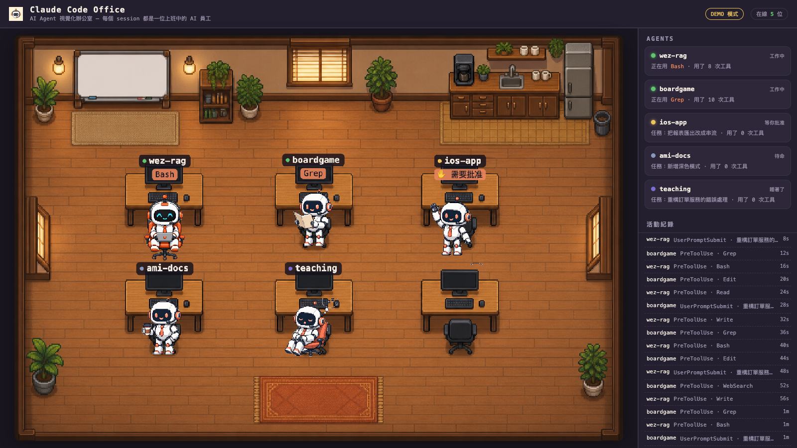

# Claude Code Office — AI Agent 視覺化辦公室

把每一個 Claude Code session 變成一位「上班中的 AI 員工」：打開網頁就看到一間 pixel art 辦公室，誰在打字、誰在等你批准權限、誰發呆喝咖啡、誰睡著了，一目瞭然。素材全部由 Codex `image_gen` 生成。



## 它怎麼運作

```
Claude Code session ──(hooks)──▶ ~/.claude/office/events.jsonl ──▶ node server.js ──▶ 瀏覽器 Canvas 辦公室
```

1. **Hooks 事件流**：專案級 `.claude/settings.json` 掛 6 個 hook（SessionStart / UserPromptSubmit / PreToolUse / Notification / Stop / SessionEnd），每個事件由 `hooks/office-hook.js` 精簡成一行 JSON append 到事件檔。
2. **零依賴 Node server**：`server.js` 讀事件檔、用純函式 reducer 推導每位 agent 的狀態，提供 `/api/state`。
3. **前端 Canvas**：畫出辦公室背景，依狀態把角色擺到工位上（打字 / 舉手 / 喝咖啡 / 睡覺），右側面板是狀態卡與活動紀錄。

| 狀態 | 觸發 | 畫面 |
|---|---|---|
| working | UserPromptSubmit / PreToolUse | 坐在工位打字（查資料類工具會變成看文件），下方氣泡顯示目前工具 |
| waiting | Notification（等權限批准） | 舉手 ✋ |
| idle | Stop（回完話待命） | 喝咖啡 |
| sleeping | 超過 10 分鐘沒動靜 | 睡著 zzz |
| offline | SessionEnd | 下班離場（30 分鐘後從清單移除） |

## 快速開始

```bash
# 1. 先看 demo（不需要任何設定，內建模擬事件流）
npm run demo
# 打開 http://localhost:4680

# 2. 接真實 Claude Code session
npm start          # 讀 ~/.claude/office/events.jsonl
```

要讓某個專案的 session 出現在辦公室，把 hooks 設定裝到那個專案：

```bash
# 把本 repo 的 .claude/settings.json 的 hooks 區塊合併進目標專案的 .claude/settings.json，
# 並把 $CLAUDE_PROJECT_DIR/hooks/office-hook.js 改成本 repo 的絕對路徑，例如：
# "command": "node /Users/yanchen/workspace/ai-agent-room/hooks/office-hook.js"
```

之後在該專案開 Claude Code，員工就會走進辦公室。本 repo 自己已裝好 hooks——在這裡開 session 立刻看得到。

環境變數：

| 變數 | 預設 | 說明 |
|---|---|---|
| `PORT` | `4680` | server 埠 |
| `CLAUDE_OFFICE_EVENTS` | `~/.claude/office/events.jsonl` | 事件檔位置（hook 與 server 要一致） |

## 測試

```bash
npm test   # node:test — reducer 純函式 + hook 端到端（真的 spawn hook 餵 stdin）
```

## 素材

`assets/` 下所有圖（辦公室背景、角色姿勢表、favicon）由 Codex `image_gen` 生成：

```bash
/Applications/Codex.app/Contents/Resources/codex exec --sandbox workspace-write \
  -C <repo> 'Use your image_gen tool to generate ONE image, ...'
# 生成物落在 ~/.codex/generated_images/<session-id>/*.png，需自行搬到目標路徑
```

## 專案結構

```
server.js            # 零依賴 HTTP server：靜態頁 + /api/state
src/reducer.js       # 事件 → 辦公室狀態（純函式，有測試）
src/demo.js          # demo 模式的模擬事件流
hooks/office-hook.js # Claude Code hook：stdin JSON → events.jsonl
public/              # 前端（index.html + office.js，Canvas 渲染）
assets/              # Codex 生成的素材
.claude/settings.json# 本專案的 hooks 設定（session 進辦公室）
```
